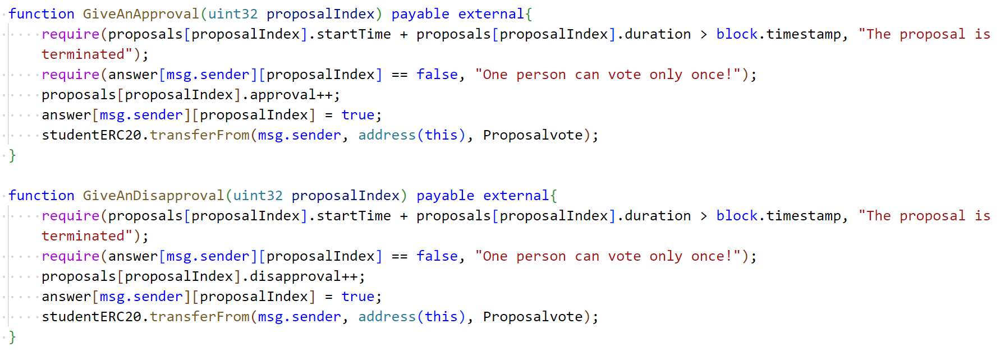

# BlockchainHW2_WQZ

## 如何运行

1. 从 github 上将 repo 代码克隆下来，放置在特定文件夹下

2. 在 ./contracts 文件夹下运行 npm install，下载所需的配置

3. 修改hardhat.config.ts, 将其中的端口改为自己的 ganache 的端口，并录入本地ganache 的账户私钥

4. 编译文件，在 ./contracts 文件夹下运行 npx hardhat compile, 若显示编译成功则可进行下一步

5. 将合约部署到本地 ganache 上，运行代码 npx hardhat run scripts/deploy.ts --network ganache 部署成功会有提示并输出三个合约的地址。

6. 复制输出的地址，分别将其粘贴到 ./frontend/src/utils/contract-address.json 文件的对应位置中

7. 将 ./contracts/artifacts/contracts 下的文件夹复制，粘贴到 ./frontend/src/utils 中，替换当中原有的代码

8. 在前端运行 npm run start ，使用翻墙工具在 Google 浏览器中打开网址，则可以正常运行

## 功能实现分析

1. 每个学生初始可以拥有或领取一些通证积分（ERC20）
   
   实现方式：首先我们要创建 ERC20 的 constract, 并在创建时给发布者分配一些通行证积分用于后续发放。在ERC20中新写了一个函数 airdrop()，其作用是为每一位新用户分配一定数量的代币，同时内部还做了判断，每一名用户只能领取一次
   
   

2. 使用一定数量通证积分，发起关于该社团进行活动或制定规则的提案（Proposal）。
   
   当用户想要发布提案时，可以在前端填充相关的标题与内容信息并选择发布，如果代币数量不足会在前端被卡住，到了后端之后如果题目或内容为空也会报错，之后我创建一个新的提案，将改天发布时的题目，内容，发布者，发布时间，提案id等保留下来，并将持续时间设置为5min，最后将收取所需的代币。
   
   

3. 提案发起后一定支出时间内，使用一定数量通证积分可以对提案进行投票 (赞成或反对，限制投票次数)，投票行为被记录到区块链上。
   
   在投票时，我需要做出两次判断(如下图)：首先要判断投票的提案是否已经过期，其次要判断投票者是否已经对该提案投过票，然后我将投票的效果记录在区块链上，投票之后则要向投票者收取一定的费用。
   
   

4. 提案投票时间截止后，赞成数大于反对数的提案通过，提案发起者作为贡献者可以领取一定的积分奖励。
   
   在项目结束后，我的提案将会进入待结束状态，此时该提案结果已经无法更改，但需要有参与者将其结束掉，在这里主动结束提案将其记录在区块链上的人将会获得一定的奖励。同时该提案将会被检查，如果提案通过，将会奖励给发布提案者一定的奖励，并将记录存下，当发起者通过三次提案时将会获得纪念币奖励 (Bonus)
   
   

5. 发起提案并通过3次的学生，可以领取社团颁发的纪念品（ERC721）
   
   首先，我需要引入相应的源文件，并创建我的contract:
   
   
   
   创建成功之后，我在上面的终结提案的函数中进行了使用

## 项目运行截图

运行项目后进入如下界面：

点击连接，连接成功后点击领取新人积分，此时我就可以领取到1000初始积分，重复操作会报错：

下面我发布四个提案并分别点支持/拒绝操作，此时历史提案和当前提案会同步显示：

可以看到发布四个提案并点支持/反对会消耗掉我的积分值：

结束提案：当有提案的时间截至后，主动结束提案的人将会获得一定奖励，同时对提案进行结算，如下图所示，我发布了四个提案，三个提案通过，获得了相应的奖励积分，同时因为我累计三个提案通过，获得了一份纪念品：

## 参考内容

1. github上的demo示例，

2. Solidity编程教学 https://www.bilibili.com/video/BV1St411a7Pk
